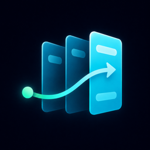

# Flowdeck

Flowdeck — портфолио-приложение для управления проектами и задачами. Это React SPA с Kanban-досками, деталями задач, фильтрами, аналитикой, ролями пользователей, двуязычным интерфейсом и backend на Supabase.



## Демо

Netlify: [https://flowdeck-kanban.netlify.app](https://flowdeck-kanban.netlify.app)

## Демо-аккаунты

Менеджер:

```txt
Email: manager@gmail.com
Password: manager1234
```

Исполнитель:

```txt
Email: executor@gmail.com
Password: executor1234
```

Гость:

```txt
Email: guest@gmail.com
Password: guest1234
```

Админ-доступ не опубликован, чтобы защитить демо-данные от случайного удаления или порчи (готов предоставить лично).

## Возможности

- Kanban-доски с проектами, досками, колонками и задачами.
- Карточка задачи с исполнителем, тегами, чеклистом, комментариями и историей активности.
- Фильтры задач, список «Мои задачи» и аналитика по доске.
- Supabase Auth, Postgres, RLS-политики и RPC-мутации.
- Ролевая модель для `admin`, `manager`, `worker` и `guest`.
- Лимиты на количество проектов, досок, колонок, задач и тегов.
- Русский и английский интерфейс.
- Темная/светлая тема и настройка плотности доски.
- Ленивая загрузка маршрутов, строгая типизация и type-aware linting.

## Как пользоваться

1. Войдите через один из демо-аккаунтов.
2. Выберите проект в боковой панели.
3. Переключайтесь между досками проекта через вкладки в верхней части страницы.
4. Создавайте и перемещайте задачи на Kanban-доске в рамках прав своей роли.
5. Открывайте задачу, чтобы изменить описание, исполнителя, теги, чеклист, комментарии, приоритет и дедлайн.
6. Используйте раздел **Мои задачи**, чтобы посмотреть назначенные задачи из доступных проектов.
7. Используйте раздел **Аналитика**, чтобы оценить прогресс доски и распределение задач.
8. В **Настройках** можно изменить тему, язык, плотность доски, данные профиля и теги.

Роли:

- `admin`: управляет проектами и участниками, но не редактирует содержимое досок.
- `manager`: управляет досками, колонками, задачами и тегами.
- `worker`: создает задачи на себя и работает с назначенными задачами.
- `guest`: имеет доступ только на просмотр проектов и досок.

## Стек

- React 19, TypeScript 6, Vite 8, React Router
- Zustand
- TanStack Query для server state
- Supabase Auth and Postgres
- React Hook Form, Zod
- Tailwind CSS v4
- Vitest, React Testing Library, ESLint

## Локальный запуск

Требуется Node.js `>=22.13.0`.

```bash
npm install
```

Создайте `.env.local`:

```env
VITE_SUPABASE_URL=https://your-project-ref.supabase.co
VITE_SUPABASE_ANON_KEY=your-anon-public-key
```

Запустите проект локально:

```bash
npm run dev
```

Локальный URL по умолчанию:

```txt
http://127.0.0.1:5173/
```

## Скрипты

```bash
npm run typecheck
npm run lint
npm run test -- --run
npm run build
npm run preview
```

## Supabase

В репозитории есть Supabase migrations и Edge Function `delete-self` для удаления аккаунта.

Обязательные frontend-переменные:

```txt
VITE_SUPABASE_URL
VITE_SUPABASE_ANON_KEY
```

Нельзя добавлять Supabase service role key во frontend-код или публичные переменные окружения Netlify.

## Деплой

Настройки для Netlify:

```txt
Build command: npm run build
Publish directory: dist
```

В Netlify нужно добавить те же переменные окружения:

```txt
VITE_SUPABASE_URL
VITE_SUPABASE_ANON_KEY
```

## CI/CD

GitHub Actions запускает базовые проверки для pull request и push в `main`:

```bash
npm ci
npm run lint
npm run typecheck
```

Netlify подключен к ветке `main`. После merge в `main` Netlify запускает `npm run build` и публикует директорию `dist`.
